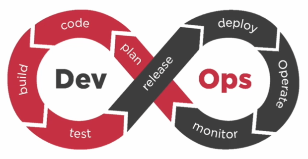

# 认识大前端

## 1. 软件项目开发流程

> 项目定义->需求分析->开发阶段->维护/结束

## 2. 敏捷流程

DevOps (develop operations)

> plan -> code -> build -> test -> release -> deploy -> Operate -> monitor

## 3. 如何获取趋势信息

### 3.1. [Github Trending](https://github.com/trending)

### 3.2. 招聘网站趋势分析
